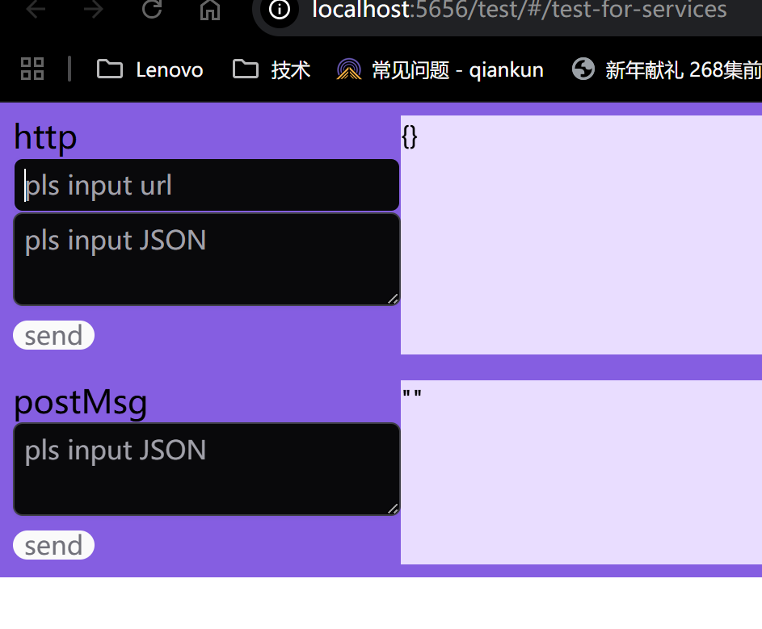

# Tester README
##  Description
此包提供测试功能
1. 提供测试http接口在webView中自定义传参进行测试的能力
2. 提供测试postMessage 接口在webView中自定义传参进行测试的能力
## 使用方式
   
### 1. http
输入全url路径，输入json/对象参数后点击send按钮，返回结果会在右侧显示
### 2. postMessage
输入整体postMessage参数进行测试，返回结果会在右侧显示。
发现问题请联系zhuxi1@lenovo.com